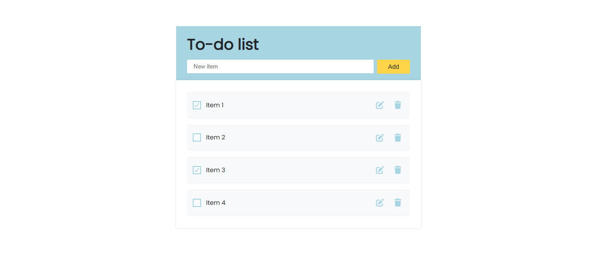
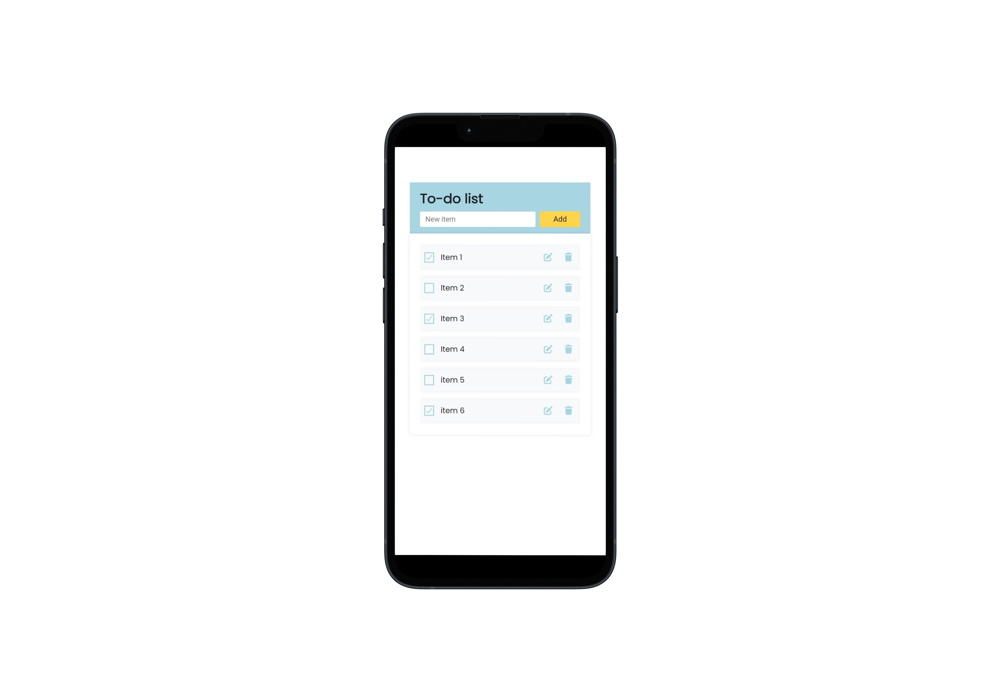

# To-do List

  

### Tela Desktop

### Tela Mobile

## Descrição

Este projeto é uma aplicação de lista de tarefas (To-do List) simples e interativa, que permite ao usuário gerenciar suas tarefas diárias. A interface foi construída com HTML, CSS e JavaScript puro, com foco em uma experiência de usuário limpa e funcional. As tarefas são salvas no `localStorage`, garantindo que os dados persistam mesmo após o fechamento do navegador.

## Objetivo

O principal objetivo deste projeto foi aprimorar e treinar habilidades de desenvolvimento front-end, incluindo:

- Manipulação avançada do DOM para criar, ler, atualizar e deletar elementos de forma dinâmica.
- Separação de responsabilidades e organização de código JavaScript em módulos (UI, estado, eventos).
- Criação de um projeto real, útil e com design agradável.
- Treinar o uso de métodos de array modernos (`Array.from`, `forEach`, spread operator).
- Aprender e implementar a persistência de dados no navegador com `localStorage`.

## Tecnologias Utilizadas

- **HTML5** (Estrutura semântica)
- **CSS3** (Estilização responsiva com Flexbox e variáveis CSS)
- **JavaScript (ES6+)** (Modularizado para manipulação do DOM e lógica)
- **LocalStorage API** (Para armazenamento de dados no navegador)

## Funcionalidades

- **Adicionar Tarefas:** Campo de texto para inserir novas tarefas na lista.
- **Editar Tarefas:** Botão para modificar o nome de uma tarefa existente.
- **Excluir Tarefas:** Opção para remover tarefas da lista.
- **Marcar como Concluída:** Marcar e desmarcar tarefas, com feedback visual.
- **Persistência de Dados:** As tarefas são salvas no `localStorage`, mantendo-se disponíveis após recarregar a página.
- **Validação de Formulário:** Exibe uma mensagem de erro se o usuário tentar adicionar uma tarefa vazia.
- **Design Responsivo:** A interface se adapta a diferentes tamanhos de tela, de desktops a dispositivos móveis.

## Como Usar

1.  Clone ou baixe este repositório.
2.  Abra o arquivo `index.html` em um navegador moderno.
3.  Comece a adicionar e gerenciar suas tarefas.

## Versão Online

[https://my-done-list.netlify.app](https://my-done-list.netlify.app)

## Licença

Este projeto está sob a licença MIT. Para mais detalhes, consulte o arquivo [LICENSE](LICENSE).